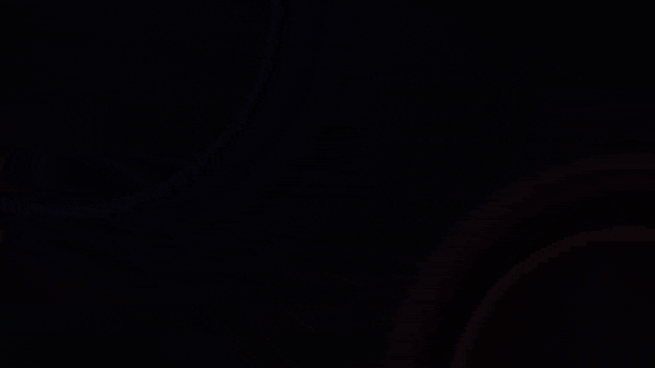

# Rulehall

[](https://github.com/mmerah/rulehall/actions/workflows/check.yml)
[](LICENSE)
[](pyproject.toml)
[](https://github.com/mmerah/rulehall/pkgs/container/rulehall)

[](docs/demo/demo.mp4)

Click the demo to watch it in full quality.

Rulehall is a browser game for solo tabletop role-playing. You type what your character does, and three AI roles and a rules engine play the rest of the table. When a setting turns it on, a fourth role, the opponent, plays the other side of a battle.

- The **game master** applies the rules. It rolls through the engine, changes the world through tools, and ends each turn by telling the narrator what matters.
- The **narrator** writes the prose you read. It only ever sees what your character has learned, so it can't spoil a secret.
- The **worldsmith** writes the opening scene and keeps growing the world while you play: the next place, a complication, a new face.

Python code owns the rules. It rolls the dice, checks every change the game master asks for, and keeps and saves the game state. The AI roles never touch the save.

Four rule sets ship with the app:

- **Loner 3e** plays in scenes. An oracle answers yes or no, sometimes with a twist, and you decide where the story goes next.
- **Tunnel Goons** is a dungeon crawl on a map. You walk, fight and rest, and the map grows whenever you reach its edge.
- **24XX** is science fiction in scenes: one skill die, three outcome bands, and gear that breaks to soften a hit.
- **Pokemon** is a whole region on a map. Skill checks roll a d20, and battles play out in the Pokemon Showdown simulator and its battle view.

A scenario is a backdrop, a premise, a scope and an opening scene. The worldsmith writes one from your prompt, or from a document you drop in (Markdown, text or PDF). A character is one sheet per rule set. Some of both come with the game, and you can make your own in the app. Each rule set plays from a pack, which is either its own tables or a full kit with a backdrop, names, traits and adventure seeds. Loner ships with twelve genre packs, and you can write a pack of your own on the **New pack** page.

Play runs on the AI subscription you already have, through the `claude` or `codex` command. Scene art is optional and off by default, and it uses its own provider key.

A note on that: Rulehall is not affiliated with or endorsed by Anthropic or OpenAI. It drives their command-line tools with your own account. Whether that kind of use is allowed is up to their terms, which can change, and either of them could restrict or end it at any moment. Check their terms yourself, and if you'd rather be on the safe side, point the roles at a completion API instead: OpenRouter with your own key, or a local model (see below).

## Start the app

You need `uv` and an AI command-line program, Claude Code (`claude`) or Codex (`codex`), installed and logged in. The default settings use `claude`. Rulehall runs on Linux and Windows. It should run on macOS too, but nobody has tried it there yet.

1. Install the project.

   ```bash
   uv sync
   ```

2. Start the app.

   ```bash
   uv run rulehall
   ```

3. Open the address the command prints.

Everything else, the AI commands included, lives on the Settings page. Each setting is a key in `.env`, and saving applies it at once, except for the server address and port, which wait until the server next starts.

A role doesn't have to use a command. Under Roles, set its provider to `openrouter` or `local` and name a model that supports tool calls: `deepseek/deepseek-v4-flash-0731` on OpenRouter, for example, or a tool-capable model that Ollama serves at the local default, `http://localhost:11434/v1`. Each provider's base URL and key live under Providers. Over a completion API, the narrator and the worldsmith answer in one request each, and the master plays its tools inside the app's own process.

What you make is kept next to the app:

- `user/characters/<id>/<engine>.json`: one sheet per rule set.
- `user/scenarios/<id>/world.json`: the opening the worldsmith wrote.
- `packs/<engine>/<id>.json`: the packs you wrote in the app. Edit the file to change a pack. The shipped packs are read-only.

The shipped `scenarios/` and `characters/` are read-only too, and if one of yours has the same id, the shipped one wins.

Saves carry no version. When a change alters the stored shape, older saves go stale: the launcher skips them with a warning, and it never migrates or deletes them.

## Pokemon battles

The Pokemon rule set runs its battles in Pokemon Showdown, a Node program, so it needs a bit of extra setup.

1. Install Node 22.

2. Install the simulator, its battle view and the sprites.

   ```bash
   npm --prefix src/rulehall/engines/pokemon/showdown run setup
   ```

The setup downloads about 220 MB and takes a few minutes. The sprites cover every species in the dex, and once the setup is done the game needs no network. The dex export (`npm --prefix src/rulehall/engines/pokemon/showdown run export-dex`) and the pack export (`npm --prefix src/rulehall/engines/pokemon/showdown run export-packs`) do need the network, and they're only for maintainers.

Rulehall is a free fan project, not affiliated with Nintendo, Creatures Inc., Game Freak or The Pokemon Company. The sprites, music and Pokedex entries belong to them. [docs/POKEMON.md](docs/POKEMON.md#licence-and-attribution) lists what comes from where.

## Play from another device

By default the app only listens on its own computer. Tailscale is a simple way to reach it from your other devices, at home or away. You'll need a free Tailscale account.

1. Install Tailscale on the computer that runs the app, then log in. On Linux:

   ```bash
   curl -fsSL https://tailscale.com/install.sh | sh
   sudo tailscale up
   ```

2. Add this line to `.env`, then restart the app.

   ```bash
   SERVER__HOST=0.0.0.0
   ```

3. Find the computer's Tailscale name, on the first line of:

   ```bash
   tailscale status
   ```

4. Install the Tailscale app on the other device and log in with the same account.

5. On that device, open `http://<name>:8080`. If the name doesn't work, use the `100.x.x.x` address from step 3.

The app has no login. Any device that can reach the port can play and change every setting, keys and provider addresses included. The page never shows a stored key, but please don't open the port to the internet.

## Run in Docker

Every push to `master` publishes `ghcr.io/mmerah/rulehall`, tagged `latest` and `sha-<commit>`, and each release adds its version, like `0.1.0`. The image holds Python, Node, the Pokemon Showdown simulator, and the `claude` and `codex` commands. It holds no Pokemon art or sound: on its first start, the container fetches them (about 220 MB, a few minutes) into `/data` in the background. The other rule sets work at once, and Pokemon battles open once the log says `Pokemon art and sound: ready.` After that, the game needs no network.

```bash
docker run -d -p 8080:8080 \
  -v rulehall-data:/data -v rulehall-home:/home/rulehall \
  -e CLAUDE_CODE_OAUTH_TOKEN=<token> \
  ghcr.io/mmerah/rulehall
```

- `/data` holds `.env`, `saves/`, `packs/`, `user/` and `vendor/` (the Pokemon art and sound).
- `/home/rulehall` holds the logins of the AI commands.
- Make the token with `claude setup-token` on a computer that has a browser.
- For OpenRouter, set `PROVIDERS__OPENROUTER__API_KEY`, or enter the key on the Settings page.
- Set `FETCH_POKEMON_ASSETS=false` to skip the fetch. Pokemon battles then stay off. If the fetch fails, restart the container: it resumes where it stopped.
- `GET /status` answers `{"busy": <bool>, "idle_seconds": <float>}`. `busy` is true while a turn is playing or a scenario or pack is being written.

## Project information

- [CLAUDE.md](CLAUDE.md) holds the development rules and checks.
- The [releases](https://github.com/mmerah/rulehall/releases) say what changed in each version.
- [CONTRIBUTING.md](CONTRIBUTING.md) explains how to report a bug, suggest an idea or send a change.
- [SECURITY.md](SECURITY.md) explains how to report a vulnerability.
- The notes for [Loner 3e](docs/LONER-3E.md), [Tunnel Goons](docs/TUNNEL-GOONS.md) and [24XX](docs/24XX.md) cover sources, license, attribution, and where the app differs from the published rules. The [Pokemon notes](docs/POKEMON.md) cover sources, licenses, and the rules we chose.

## License

The code is MIT, © 2026 Mounir Merah. Read [LICENSE](LICENSE). The rule sets below keep their own licenses.

Loner v.3.0 © 2025 Roberto Bisceglie, CC BY-SA 4.0 — attribution in the [Loner notes](docs/LONER-3E.md).

Tunnel Goons is © Nate Treme, released under a Creative Commons 4.0 International License — attribution in the [Tunnel Goons notes](docs/TUNNEL-GOONS.md).

24XX rules (v1.4) are CC BY Jason Tocci — attribution in the [24XX notes](docs/24XX.md).
